# EduDash ERP - Roles & Capabilities Map

This is an editable roles-and-features map. To make it extremely readable and clear, the visual flow maps are split **Module-Wise** to show exactly **who is doing what** and **who is viewing what** within each functional area.

---

## 🗺️ 1. Module-Wise Visual Flow Maps

These charts map user actions (Doing) and access levels (Viewing) for each major section.

### 📝 1.1 Attendance Logs Module
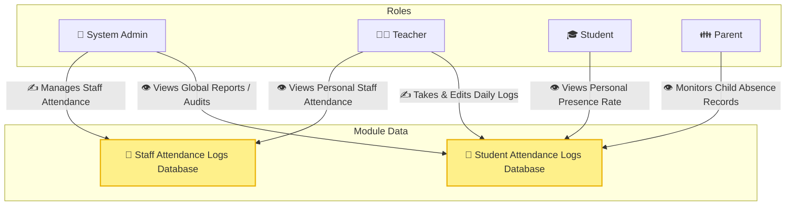

---

### 📚 1.2 Assignments & Homework Module
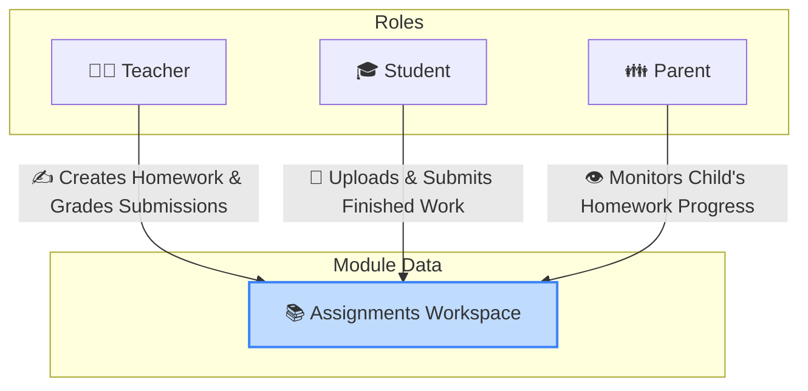

---

### 🎯 1.3 Exams & Results Publication Module
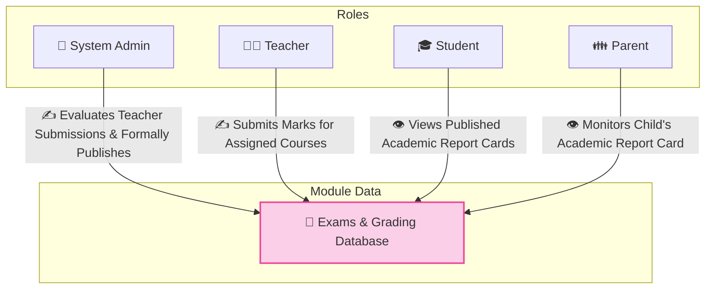

---

### 📬 1.4 Leave Request System Module
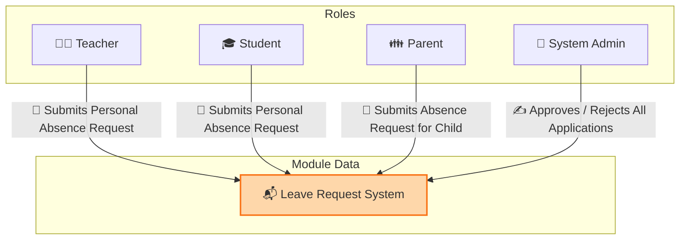

---

### 🏫 1.5 Academics, Classes & Timetables Module
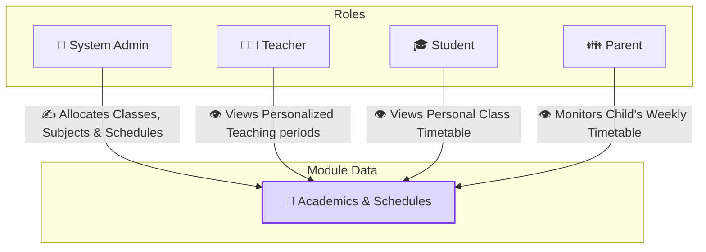

---

### 💰 1.6 Fees & Finances Module
```mermaid
graph TD
    subgraph "Roles"
        Admin["👑 System Admin"]
        Student["🎓 Student"]
        Parent["👪 Parent"]
    end

    subgraph "Module Data"
        M_Finances["💰 Fees & Payments Ledger"]
    end

    Admin -->|✍️ Creates Collections & Records Ledger Payments| M_Finances
    Parent -->|💬 Reviews Bills & Pays Fees digitally| M_Finances
    Student -->|👁️ Views Outstanding Invoices & Balances| M_Finances

    style M_Finances fill:#bbf7d0,stroke:#22c55e,stroke-width:2px
```

---

### 📝 1.7 Question Paper Management Module
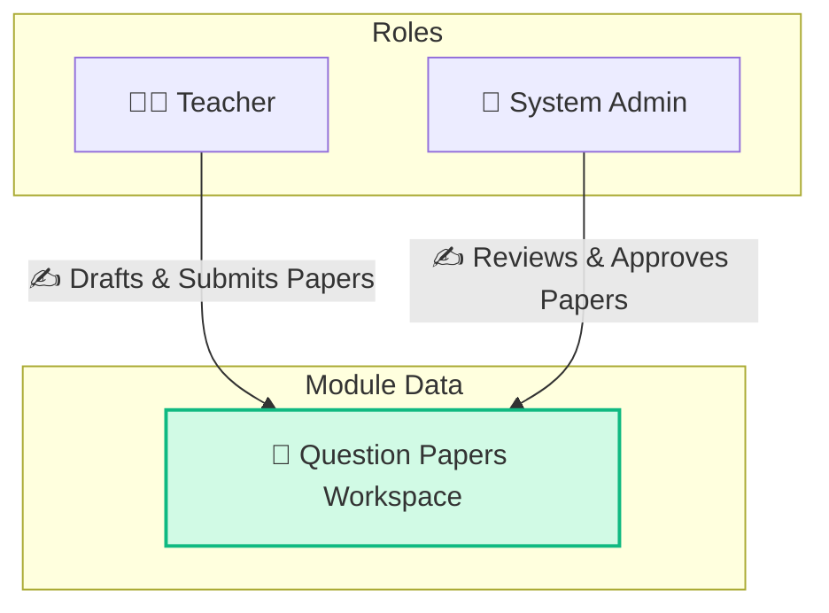

---

### 🚌 1.8 Transport & Logistics Module
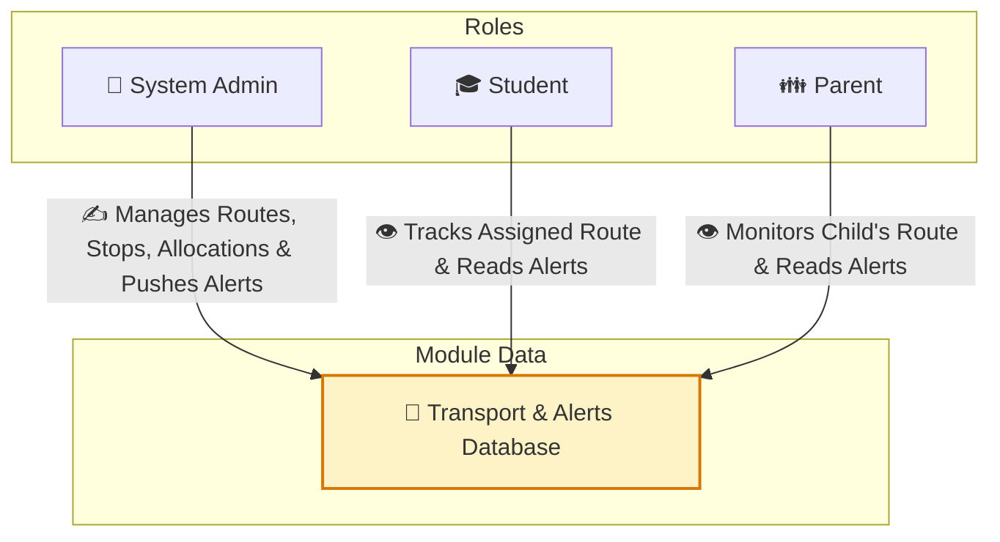

---

### 🎧 1.9 Support Center Module
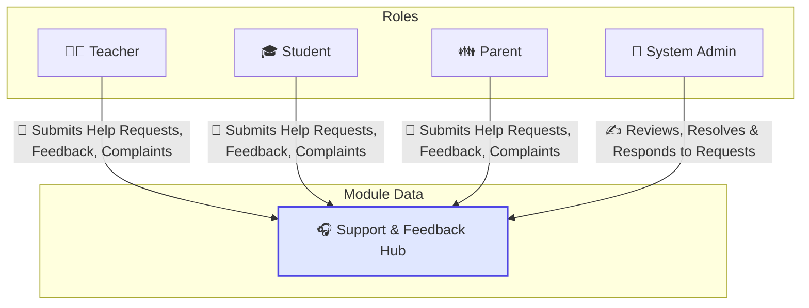

---

### 🛡️ 1.10 Student Duty Management Module
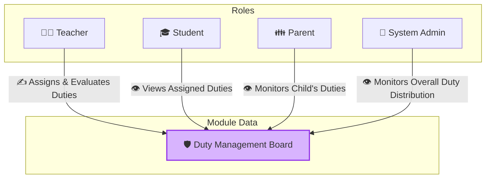

---

### 👥 1.11 User Accounts Directory & Employee Management Module
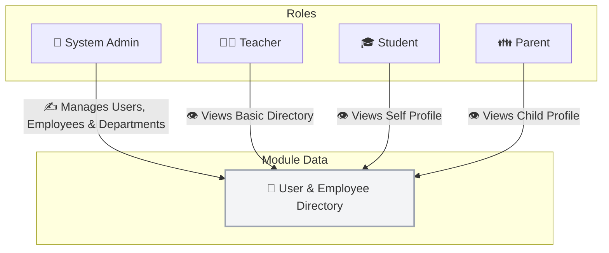

---

### 🎨 1.12 Clubs & Co-curricular Module
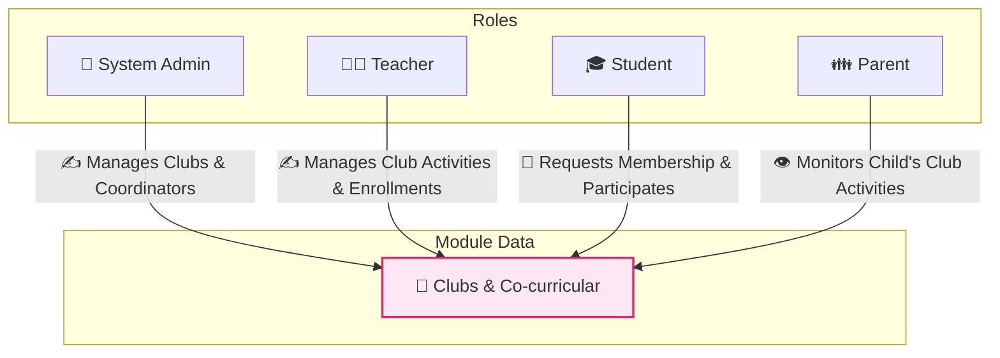

---

### 📢 1.13 Notices & Announcements Module
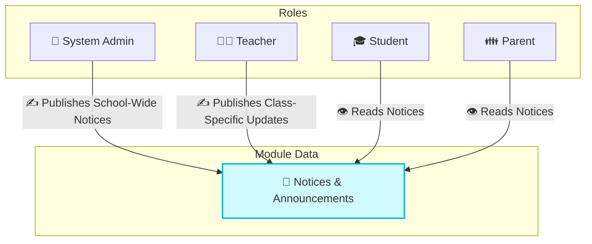

---

### 📊 1.14 Workload & Performance Analytics Module
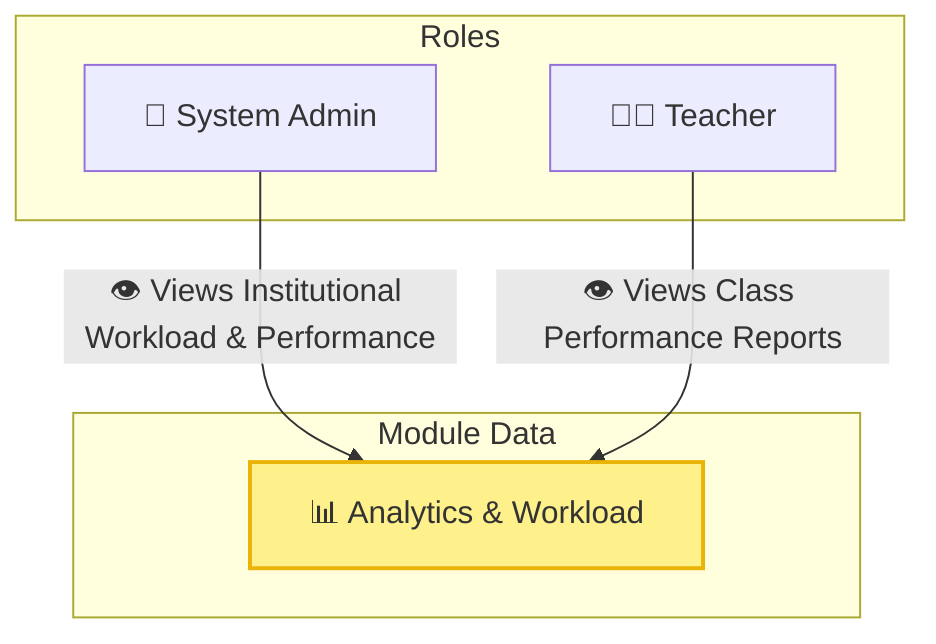

---

## 📊 2. Permissions Matrix Grid

This grid maps features to roles using permissions. You can easily add rows for new features or update cell symbols.

### Key to Actions:
* `✍️ Manage` : Full permissions (Create, Read, Update, Delete)
* `💬 Interact` : Limited write capability (e.g., submit a form, upload an assignment, send a message)
* `👁️ View` : Read-only capability (filtered by scope)
* `❌ None` : No access or hidden from sidebar

| Feature / Module | Admin (`ADMIN`) | Teacher (`TEACHER`) | Student (`STUDENT`) | Parent (`PARENT`) |
| :--- | :---: | :---: | :---: | :---: |
| **User Accounts Directory** | `✍️ Manage` | `👁️ View (Basic)` | `👁️ View (Self)` | `👁️ View (Child)` |
| **Employee & Department Management** | `✍️ Manage` | `❌ None` | `❌ None` | `❌ None` |
| **Academics, Classes & Timetables** | `✍️ Manage` | `👁️ View (Own)` | `👁️ View (Own)` | `👁️ View (Child)` |
| **Student Attendance Logs** | `👁️ View (Global)` | `✍️ Manage` | `👁️ View (Self)` | `👁️ View (Child)` |
| **Staff Attendance Logs** | `✍️ Manage (Global)` | `👁️ View (Self)` | `❌ None` | `❌ None` |
| **Assignments & Homework** | `❌ None` | `✍️ Manage` | `💬 Interact` | `👁️ View` |
| **Exams & Grading** | `✍️ Manage (Lifecycle)` | `✍️ Manage (Marks)` | `👁️ View` | `👁️ View` |
| **Question Papers** | `✍️ Manage (Approve)` | `✍️ Manage (Draft)` | `❌ None` | `❌ None` |
| **Fees & Payments Ledger** | `✍️ Manage` | `❌ None` | `👁️ View` | `👁️ View` |
| **Transport & Routes** | `✍️ Manage` | `❌ None` | `👁️ View` | `👁️ View` |
| **Leave Request System** | `✍️ Manage (Approve)` | `💬 Interact (Self)` | `💬 Interact (Self)` | `💬 Interact (Child)` |
| **Support Center** | `✍️ Manage (Resolve)` | `💬 Interact (Self)` | `💬 Interact (Self)` | `💬 Interact (Self)` |
| **Clubs & Co-curricular** | `✍️ Manage` | `👁️ View` | `👁️ View` | `👁️ View` |
| **Notices & Announcements** | `✍️ Manage` | `✍️ Manage (Class)` | `👁️ View` | `👁️ View` |
| **Student Duty Management** | `👁️ View` | `✍️ Manage` | `👁️ View (Self)` | `👁️ View (Child)` |
| **Workload Analytics** | `👁️ View` | `❌ None` | `❌ None` | `❌ None` |
| **Identity Card (View/Print)** | `👁️ View (Self/All)` | `👁️ View (Self)` | `👁️ View (Self)` | `👁️ View (Child)` |
