# Institutional Academic Calendar Workflow

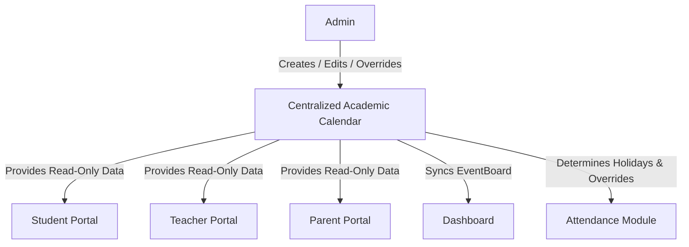

# Student Module

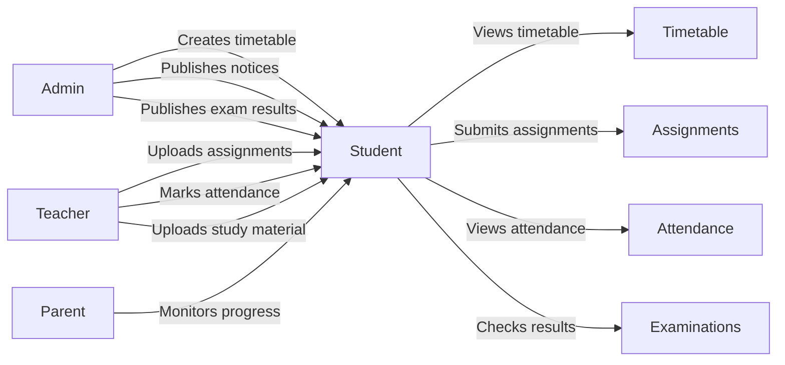


# Student Examination Consumption Workflow

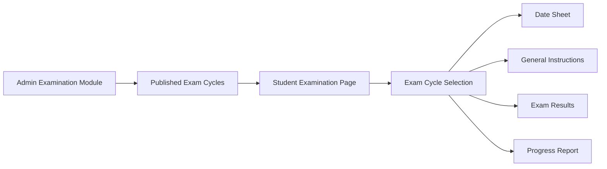

# Academic Results Consumption Workflow

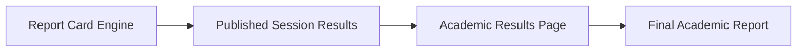

# Parent Module

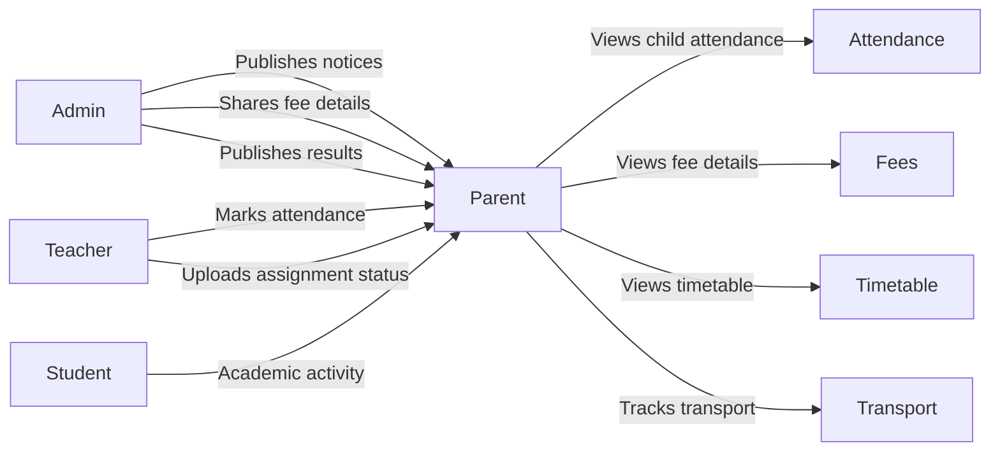


# Teacher Module

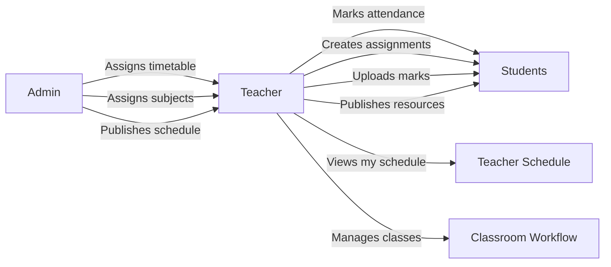


# Admin Module

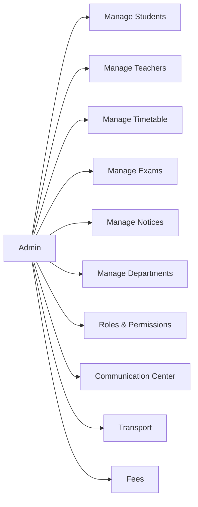


# Timetable Workflow

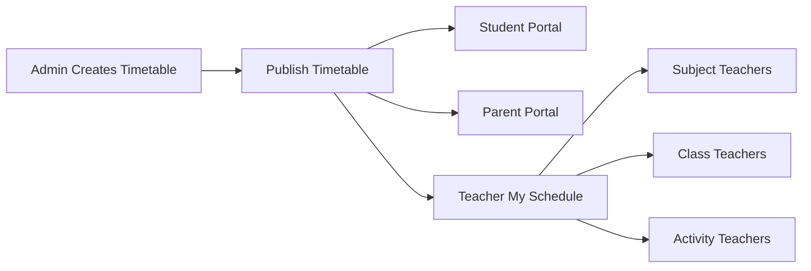


# Assignment Workflow

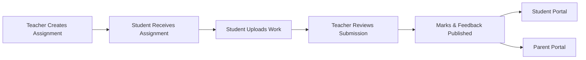


# Question Paper Management Workflow

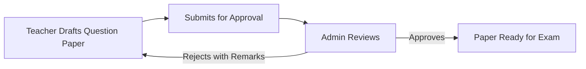


# Examination Workflow

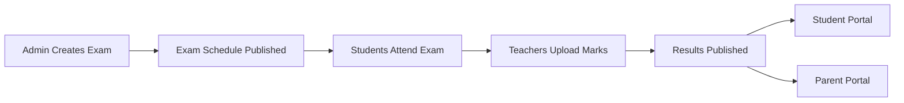


# Communication Workflow

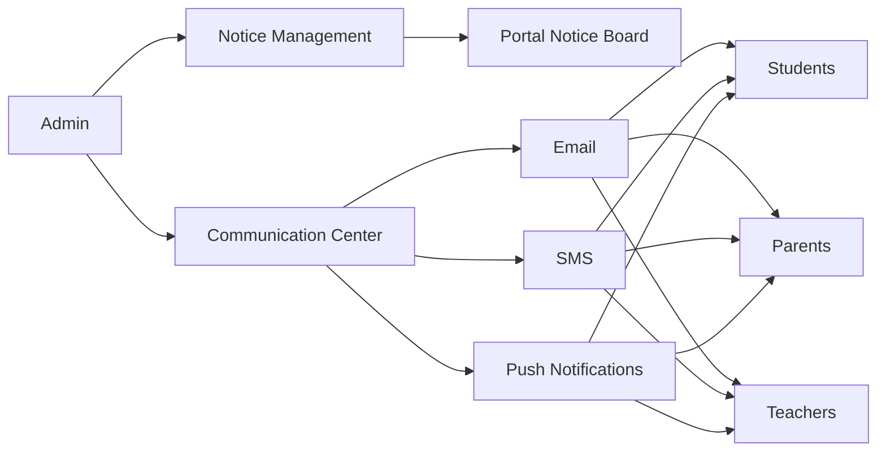


# Roles & Permissions

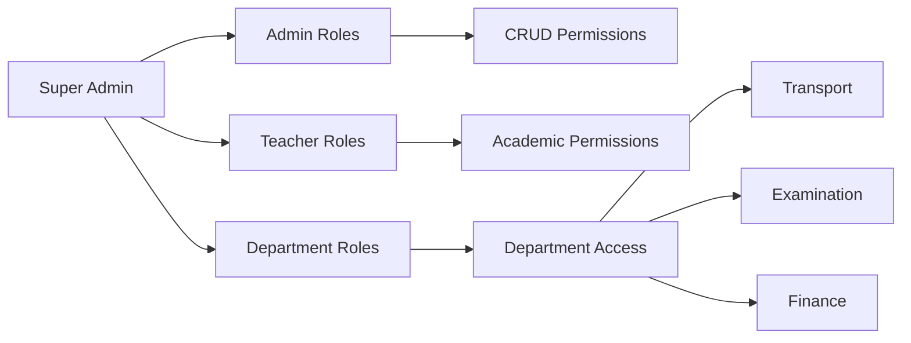


# Operational Timetable Override Workflow

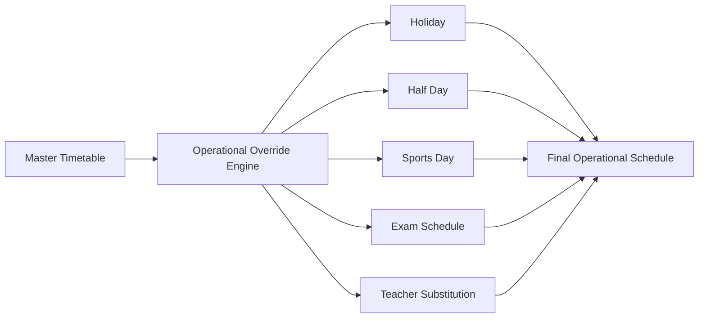


# Leave Application & Approval Workflow

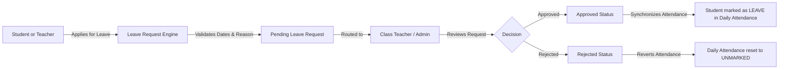


# Fee Management & Payment Workflow

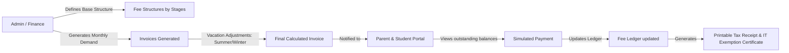


# Transport & Route Tracking Workflow

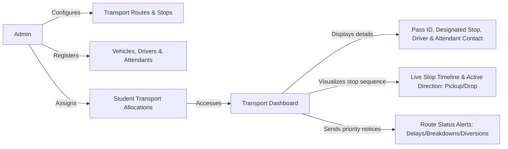


# Co-curricular Clubs & Committees Workflow

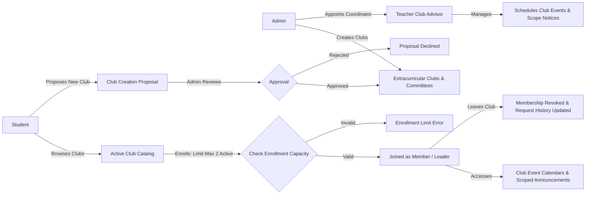


# Mentorship & Session Management Workflow

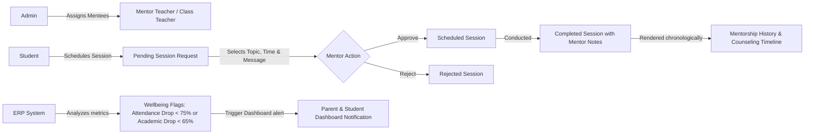


# Academic Architecture & Course Resolution Workflow

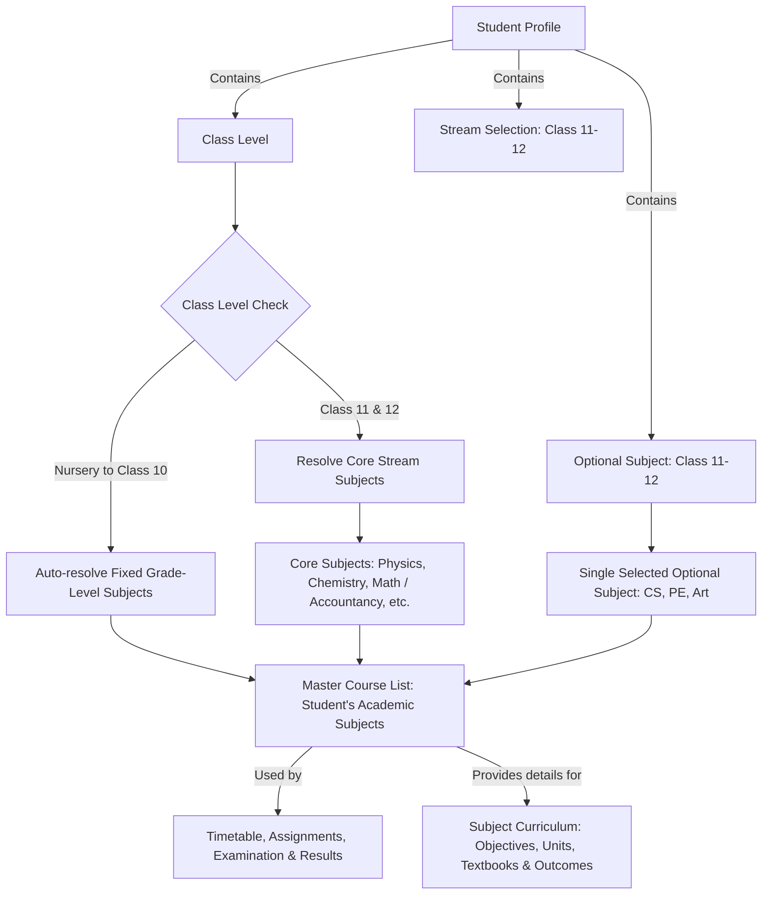

# Support Center Workflow

```mermaid
flowchart LR
    A[Student / Parent / Teacher] -->|Submits Help/Feedback/Complaint| B[Support Center Hub]
    B -->|Logs Request| C[Pending Open Request]
    C -->|Monitored by| D[Designated Support Admin]
    D -->|Reviews Details| E{Action Taken}
    E -->|Updates Status| F[In Review]
    E -->|Adds Remarks| G[Resolution Details Appended]
    F -->|Solves Issue| H[Resolved]
    G --> H
    H -->|Closes Ticket| I[Closed]
    I -->|Visible to| A
```

# Student Duty Management Workflow

```mermaid
flowchart LR
    A[Admin] -->|Monitors| B[Duty Management Board]
    C[Teacher] -->|Creates| D[Duty Request]
    D -->|Assigns| E[Students]
    D -->|Specifies| F[Date, Time, Location & Instructions]
    E -->|Receives Assignment| G[Student Duty Dashboard]
    E -->|Parents Notified| H[Parent Duty Records]
    G -->|Student Performs Duty| I[Execution]
    C -->|Marks Completion| J[Status: Completed]
    C -->|Or Cancels| K[Status: Cancelled]
    J --> B
    K --> B
```

# Attendance Governance & Communication Workflow

```mermaid
flowchart LR
    A[Admin] -->|Monitors| B[Attendance Overview Dashboard]
    B -->|Separates Data| Z{Data Streams}

    Z -->|Student Data| C{Student Thresholds}
    C -->|< 85%| D[Notification Target]
    C -->|< 60%| E[Escalation Target]
    C -->|< 30%| F[Severe Action Target]
    C -->|> 95%| G[Appreciation Target]
    
    D & E & F & G -->|Selects Students| H[Redirect to Communication Center]
    H -->|Auto-generates Body| J[Contextual Message Template for Parents]

    Z -->|Staff Data| C2{Staff Thresholds}
    C2 -->|< 90%| D2[HR Notification Target]
    C2 -->|< 80%| E2[HR Escalation Target]
    C2 -->|< 70%| F2[Severe HR Action Target]
    C2 -->|> 98%| G2[Employee Appreciation]

    D2 & E2 & F2 & G2 -->|Selects Staff| H2[Redirect to Communication Center]
    H2 -->|Auto-generates Body| J2[Contextual Message Template for Employees / Admins]

    J & J2 -->|Admin Reviews & Dispatches| K[Notification Sent via Email/SMS/App]
```

# Identity Card Workflow

```mermaid
flowchart LR
    A[Student] -->|Opens Portal| B[Student360]
    B -->|Clicks View ID Card| C[Preview Modal]
    C -->|Browser Print| D[Print / Save as PDF]

    E[Admin / Teacher / HR] -->|Opens Portal| F[Staff360 / Profile]
    F -->|Clicks View ID Card| G[Preview Modal]
    G -->|Browser Print| H[Print / Save as PDF]
```

# End-to-End Academic Pipeline

```mermaid
flowchart TD
    subgraph "Phase 1: Teacher Marks Submission"
        A[Teacher] -->|Enters Marks & Grades| B[Draft Status]
        B -->|Submits| C[Submitted Status]
        C -.->|Locked for Teacher| D[Awaiting Admin Review]
    end

    subgraph "Phase 2: Admin Evaluation & Publication"
        D -->|Admin Reviews| E{Approval}
        E -->|Rejects| F[Returned to Teacher]
        F -->|Teacher Edits| B
        E -->|Approves| G[Evaluated Status]
        G -->|Admin Publishes| H[Published Status]
        H -.->|Student/Parent Visibility| I[Exam-wise Result Preview]
    end

    subgraph "Phase 3: Academic Governance"
        J[Admin] -->|Configures| K[Assessment Governance]
        K -->|Defines| L[Assessment Categories & Weightages]
        K -->|Defines| M[Grade Boundaries & Passing Rules]
    end

    subgraph "Phase 4: Academic Report Cards"
        N[Admin] -->|Selects Class & Session| O[Generation Wizard]
        O -->|Selects Mode: Progress or Final| O2[Mode Selection]
        O2 -->|Progress Report| P[Calculation Pipeline]
        O2 -->|Final Report| PV[Governance Validation]
        PV -->|Incomplete| PVD[Development Override Warning]
        PVD -->|Continue| P
        PV -->|Complete| P
        H -->|Aggregates Published Exams| P
        L --> P
        M --> P
        P --> Q[Generated Report Cards with reportType metadata]
        Q -->|Admin Freezes| R[Frozen Status]
        R -.->|Immutable| S[Final Records]
        Q -->|Admin Publishes| T[Published Academic Report Cards]
        T -.->|Student/Parent Visibility| U[Final Session Result]
        T -.->|Admin| V[Print Operations]
    end
```

# Teacher Academic Results Workflow

```mermaid
flowchart TD
    A[Teacher Academic Results Module] --> B{teacherScope.isClassTeacher?}
    
    B -->|No| C[Permission Restricted: Subject Teacher]
    C --> D[Display Shield Alert Empty State]
    
    B -->|Yes| E[Class Teacher Unified Workspace]
    E --> F[Segmented View Selector]
    
    F -->|Default: Exam Results| G[Exam-wise Result Ledger]
    G --> H[Exam Cycle Selector]
    H -->|Selects Published Exam| I[Consumes RESULTS dataset]
    I --> J[Displays Read-Only Student Ledger]
    
    F -->|Progress Reports| O[Progress Report Workspace]
    O --> P[Exam Cycle Selector]
    P --> Q[Consumes REPORT_CARDS dataset filtered by progress]
    Q --> M[Report Card Preview]
    Q --> N[Print / Bulk Print]

    F -->|Final Academic Reports| K[Final Report Card Workspace]
    K --> L[Consumes REPORT_CARDS dataset filtered by final]
    L --> M
    L --> N
```

## 7. Attendance Runtime Flow
```mermaid
graph TD
    subgraph "Student Attendance"
        S_UI[Teacher UI] --> S_Svc[attendanceService]
        S_Svc --> S_Prov[Provider]
        S_Prov --> S_LS[(LocalStorage)]
    end

    subgraph "Staff Attendance"
        St_UI[Admin UI] --> St_Svc[staffAttendanceService]
        St_Svc --> St_Prov[Provider]
        St_Prov --> St_LS[(LocalStorage)]
    end

    subgraph "Employee Self Attendance"
        E_UI[Employee UI] --> E_Svc[staffAttendanceService]
        E_Svc --> E_Prov[Provider]
        E_Prov --> E_LS[(LocalStorage)]
    end

    subgraph "Attendance Governance"
        G_UI[Attendance Overview] --> G_Svc[Governance Service]
        G_Svc --> G_Prov[Provider]
        G_Prov --> G_LS[(LocalStorage)]
    end

    S_UI -.->|Presentation Only| S_UI
    S_Svc -.->|Business Logic| S_Svc
    S_Prov -.->|Persistence Boundary| S_Prov
```