# Student Module

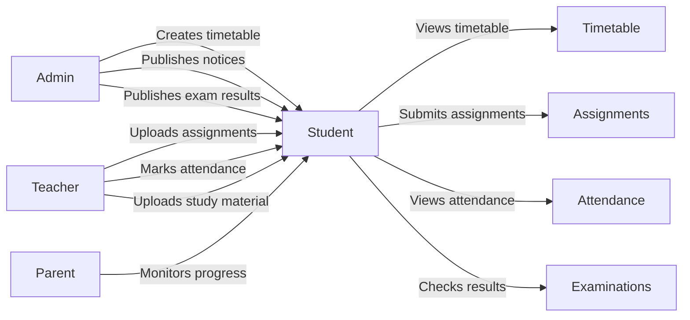


# Student Examination Consumption Workflow

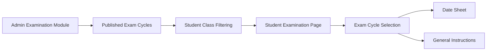

# Parent Module

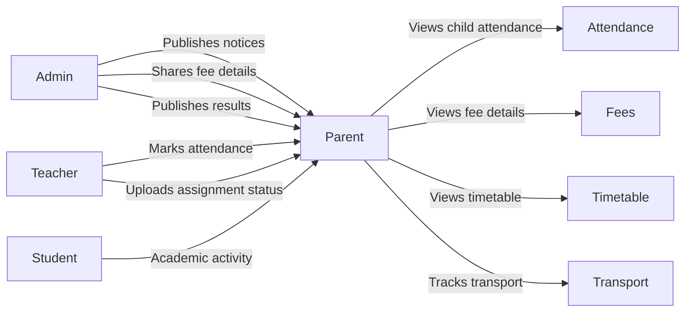


# Teacher Module

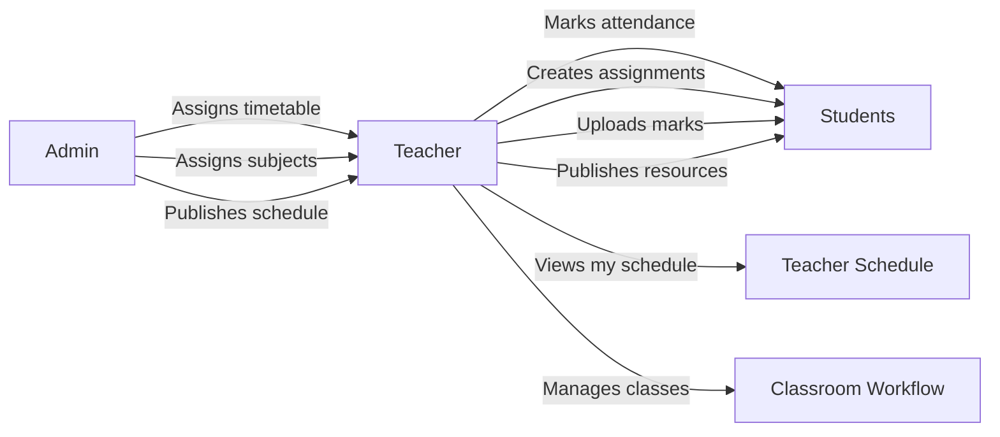


# Admin Module

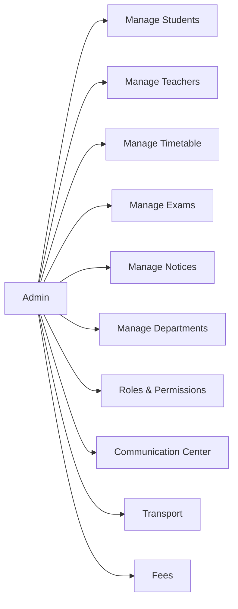


# Timetable Workflow

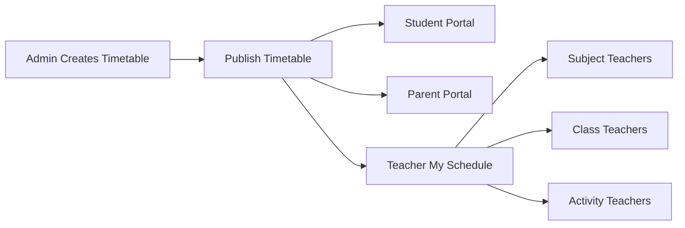


# Assignment Workflow

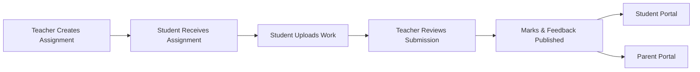


# Question Paper Management Workflow

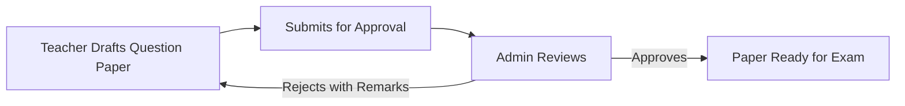


# Examination Workflow

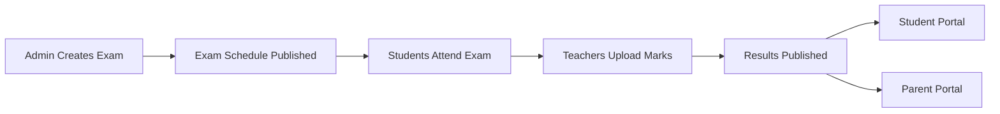


# Communication Workflow

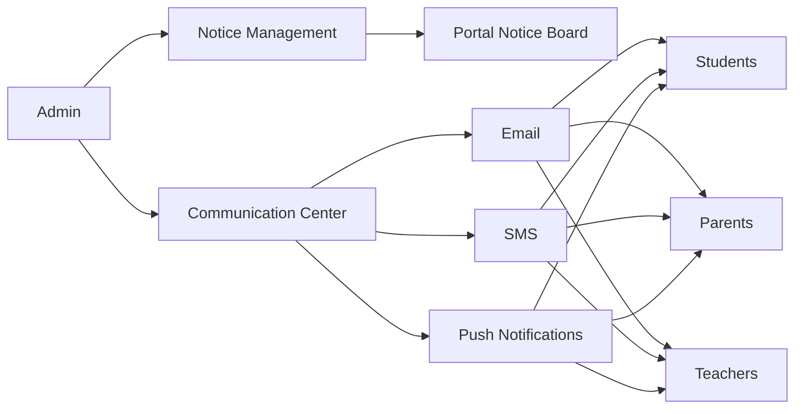


# Roles & Permissions

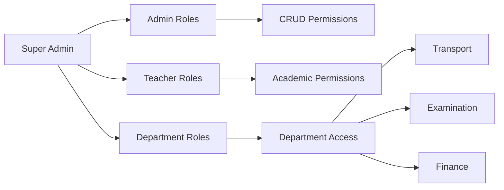


# Operational Timetable Override Workflow

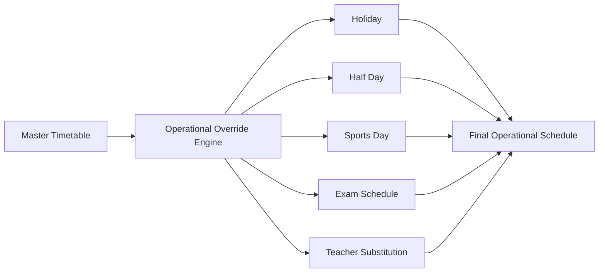


# Leave Application & Approval Workflow

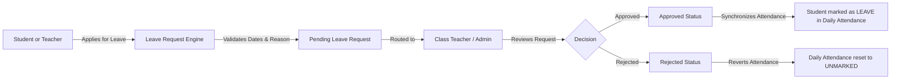


# Fee Management & Payment Workflow

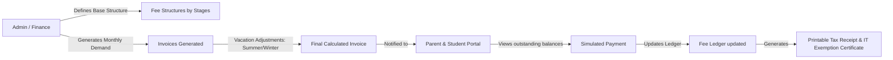


# Transport & Route Tracking Workflow

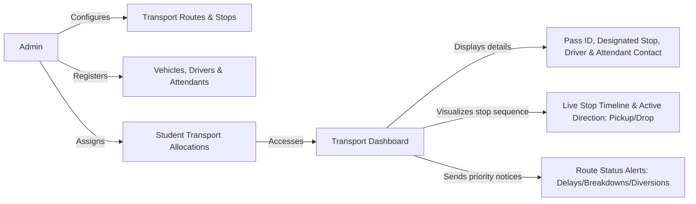


# Co-curricular Clubs & Committees Workflow

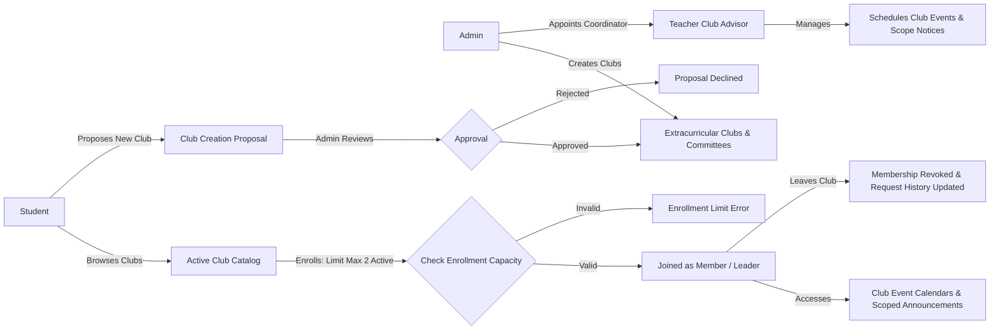


# Mentorship & Session Management Workflow

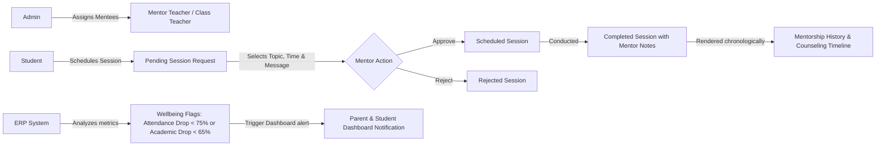


# Academic Architecture & Course Resolution Workflow

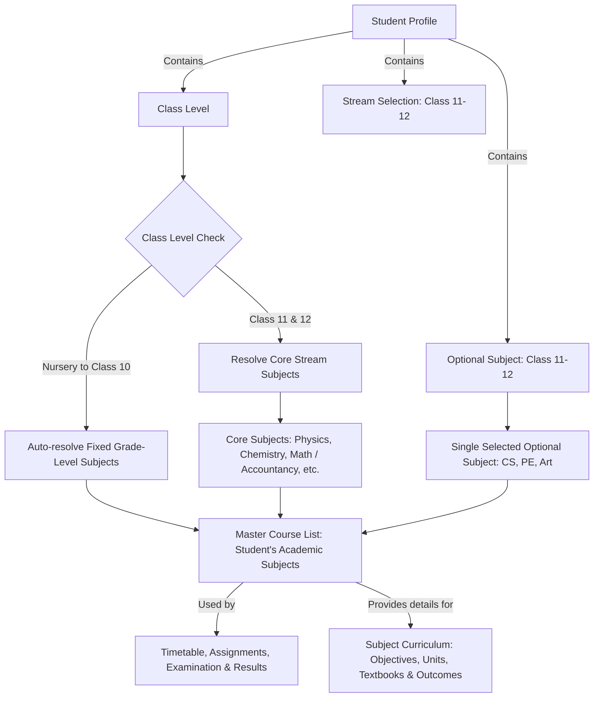

# Support Center Workflow

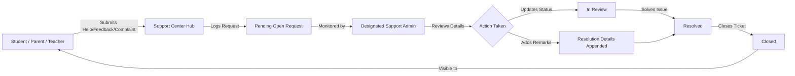

# Student Duty Management Workflow

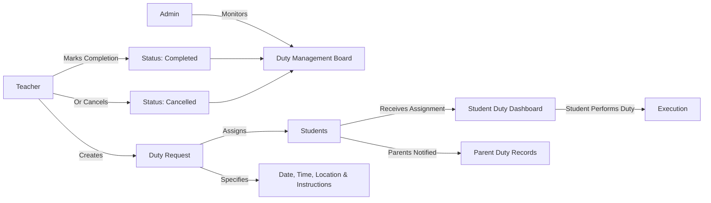

# Attendance Governance & Communication Workflow

```mermaid
flowchart LR
    A[Admin] -->|Monitors| B[Attendance Overview Dashboard]
    B -->|Identifies At-Risk Students| C{Attendance Thresholds}
    C -->|< 75%| D[Low Attendance Target]
    C -->|< 50%| E[Critical Attendance Target]
    C -->|< 30%| F[Severe Action Target]
    C -->|> 95%| G[Appreciation Target]
    
    D & E & F & G -->|Selects Students| H[Redirect to Communication Center]
    H -->|Pre-fills Data| I[Campaign Subject & Delivery Channel]
    I -->|Auto-generates Body| J[Contextual Message Template based on Threshold]
    J -->|Admin Reviews & Dispatches| K[Notification Sent via Email/SMS/App]
```

# Identity Card Workflow

```mermaid
flowchart LR
    A[Student] -->|Opens Portal| B[Student360]
    B -->|Clicks View ID Card| C[Preview Modal]
    C -->|Browser Print| D[Print / Save as PDF]

    E[Admin / Teacher / HR] -->|Opens Portal| F[Staff360 / Profile]
    F -->|Clicks View ID Card| G[Preview Modal]
    G -->|Browser Print| H[Print / Save as PDF]
```

# End-to-End Academic Pipeline

```mermaid
flowchart TD
    subgraph "Phase 1: Teacher Marks Submission"
        A[Teacher] -->|Enters Marks & Grades| B[Draft Status]
        B -->|Submits| C[Submitted Status]
        C -.->|Locked for Teacher| D[Awaiting Admin Review]
    end

    subgraph "Phase 2: Admin Evaluation & Publication"
        D -->|Admin Reviews| E{Approval}
        E -->|Rejects| F[Returned to Teacher]
        F -->|Teacher Edits| B
        E -->|Approves| G[Evaluated Status]
        G -->|Admin Publishes| H[Published Status]
        H -.->|Student/Parent Visibility| I[Exam-wise Result Preview]
    end

    subgraph "Phase 3: Academic Governance"
        J[Admin] -->|Configures| K[Assessment Governance]
        K -->|Defines| L[Assessment Categories & Weightages]
        K -->|Defines| M[Grade Boundaries & Passing Rules]
    end

    subgraph "Phase 4: Academic Report Cards"
        N[Admin] -->|Selects Class & Session| O[Generation Wizard]
        O -->|Applies Governance Rules| P[Calculation Pipeline]
        H -->|Aggregates Published Exams| P
        L --> P
        M --> P
        P --> Q[Generated Report Cards]
        Q -->|Admin Freezes| R[Frozen Status]
        R -.->|Immutable| S[Final Records]
        Q -->|Admin Publishes| T[Published Academic Report Cards]
        T -.->|Student/Parent Visibility| U[Final Session Result]
        T -.->|Admin| V[Print Operations]
    end
```