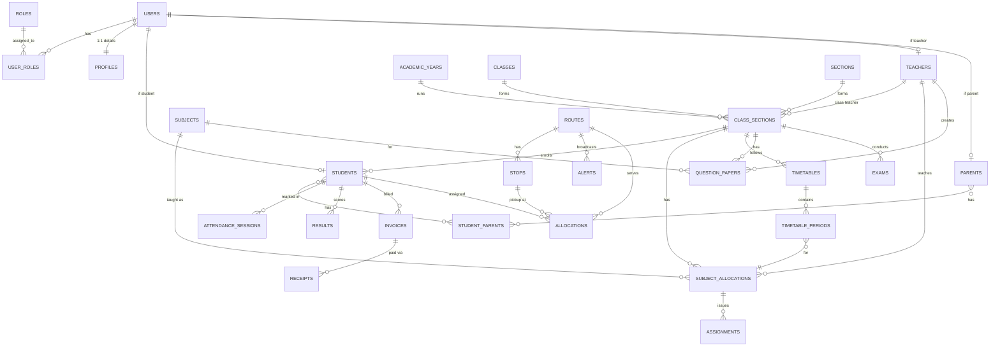

# EduDash ERP - Database Architecture Design Brief

> [!NOTE]
> This document outlines the comprehensive relational database architecture for the EduDash ERP. It is optimized for PostgreSQL and designed to accommodate current needs while keeping future scale in mind.

---

## I. Table Categorization Strategy

Understanding table purpose dictates index strategy, caching, and archiving.

*   **Core Master Tables**: Rarely change, highly cached. Example: `academic_years`, `classes`, `sections`, `subjects`.
*   **Transactional Tables**: High volume, frequently inserted/updated. Example: `attendance_records`, `invoices`, `receipts`, `exam_results`.
*   **Lookup Tables**: Static enumerations. Example: `document_types`, `leave_types`, `vehicle_types`.
*   **Relationship Tables**: Junction tables mapping entities in N:N or temporal relationships. Example: `class_sections`, `subject_allocations`, `student_parents`.
*   **Audit Tables**: Append-only logs for tracking changes. Example: `audit_logs`.
*   **Authentication Tables**: Highly secure, separate schema. Example: `users`, `roles`, `permissions`.

---

## II. Entity List & Table Definitions (Deliverables 1, 3, 4, 5, 6, 7, 15)

We recommend using **PostgreSQL Schemas** (Deliverable 15) to logically group tables. All tables use `UUID` as Primary Keys to ensure API security (prevent enumeration) and allow decentralized ID generation.

### Schema: `auth` (Authentication & Authorization)
*   **`users`**: Central authentication record.
    *   *PK*: `id` (UUID). *Fields*: `email`, `password_hash`, `is_active`, `last_login`.
*   **`roles`**: System roles (Admin, Teacher, Student, Parent, Admissions).
    *   *PK*: `id` (UUID). *Fields*: `name`, `description`.
*   **`permissions`**: Granular access rights (e.g., `fees.view`, `attendance.mark`).
*   **`role_permissions`** (Junction): Maps Roles to Permissions.
    *   *PK*: Composite(`role_id`, `permission_id`).

### Schema: `core` (Global Masters & Profiles)
*   **`profiles`**: Personal details linked 1:1 with `users`. Separating auth from profile data increases security.
    *   *PK*: `id` (UUID). *FK*: `user_id` (Unique). *Fields*: `first_name`, `last_name`, `dob`, `gender`, `phone`.
*   **`academic_years`**: Master table for academic sessions.
    *   *PK*: `id` (UUID). *Fields*: `name` (e.g., "2023-2024"), `start_date`, `end_date`, `is_active`.
*   **`classes`**: Master list (Nursery, LKG, 1...12).
*   **`sections`**: Master list (A, B, Science Non-Medical).
*   **`subjects`**: Master subjects list.

### Schema: `academic` (Academics & Enrolment)
*   **`class_sections`** (Junction/Master): The cornerstone entity connecting a Class, Section, and Academic Year.
    *   *PK*: `id` (UUID). *FKs*: `class_id`, `section_id`, `academic_year_id`, `class_teacher_id`.
*   **`students`**: Student specific data.
    *   *PK*: `id` (UUID). *FK*: `user_id`, `current_class_section_id`. *Fields*: `admission_number`, `enrollment_date`, `status`.
*   **`parents`**: Parent specific data.
    *   *PK*: `id` (UUID). *FK*: `user_id`. *Fields*: `occupation`, `annual_income`.
*   **`student_parents`** (Junction): Resolves N:N parent-student mapping.
    *   *PK*: Composite(`student_id`, `parent_id`). *Fields*: `relationship` (Mother/Father/Guardian).
*   **`subject_allocations`** (Junction): Assigns a Teacher to a Subject in a specific Class-Section.
    *   *PK*: `id` (UUID). *FKs*: `class_section_id`, `subject_id`, `teacher_id`.
*   **`timetables`** & **`timetable_periods`**: Maps time slots to `subject_allocations`.
*   **`assignments`** & **`assignment_submissions`**: Tracks homework/tasks.
*   **`question_papers`**: Handles the creation and approval workflow of exam papers.
    *   *Fields*: `id`, `title`, `teacher_id`, `subject_id`, `class_section_id`, `status` (draft, pending_approval, approved, rejected), `content`, `uploaded_file`, `approved_by` (admin user id), `approved_at`, `remarks`, `created_at`, `updated_at`.
*   **`exams`**, **`exam_schedules`**, **`results`**: Handles examination lifecycle.

### Schema: `finance`
*   **`fee_structures`**: Defines fee plans per class per academic year.
*   **`invoices`**: Billed amounts linked to `student_id`.
*   **`receipts`**: Payments made against invoices.

### Schema: `transport`
*   **`routes`**: Core bus routes mapping paths and zones.
*   **`vehicles`**: Bus/Van details including capacity and features.
*   **`drivers`**: Operational staff (links to `core.employees`).
*   **`stops`**: Sequence of pickup/drop points linked to routes.
*   **`allocations`**: Maps `student_id` to `route_id` and `stop_id`. Calculates occupancy dynamically.
*   **`alerts`**: Live system broadcast messages tied to `route_id` (or `ALL`).

### Schema: `communication`
*   **`notices`**: Announcements with `target_roles` and `target_classes` JSONB filters.

### Schema: `documents`
*   **`documents`**: Centralized file tracking.
    *   *Fields*: `entity_type`, `entity_id`, `doc_type`, `file_url`, `verification_status`.

---

## III. ER Diagram (Deliverable 2)

---

## IV. Core Architecture Strategies

### 8. Authentication Design
*   **Strategy**: JWT (JSON Web Tokens) stateless architecture.
*   **Implementation**: API issues short-lived Access Tokens (15m) and secure, HTTP-Only, SameSite Refresh Tokens (7d).
*   **Separation**: Credentials live exclusively in `auth.users`. Personal data lives in `core.profiles`. This drastically reduces the security surface area.

### 9. Student Lifecycle Design
*   Students maintain a single `students` record throughout their journey.
*   They have a `status` field: `ENQUIRY` -> `ACTIVE` -> `PROMOTED` -> `ALUMNI` -> `TRANSFERRED`.
*   **Promotion**: Moving to a new class simply updates their `current_class_section_id` to a new record in the next `academic_year`. Historical data (attendance, grades) remains safely tied to their old `class_sections` ID via Foreign Keys.

### 10. Admission Workflow Design
*   **Entity**: `admissions.applications`.
*   **Workflow**: 
    1. Public user creates account (Role: `Admissions_User`).
    2. Submits Application (Status: `DRAFT` -> `SUBMITTED`).
    3. Admin verifies documents (Status: `VERIFIED`).
    4. Interview scheduled via `admissions.interviews`.
    5. Admin approves (Status: `APPROVED`).
    6. System triggers "Conversion": Creates `students` record, creates/links `parents` record, updates User Role to `Parent`/`Student`, changes application status to `CONVERTED`.

### 11. Recommended Indexes
*   **B-Tree Indexes**: Create explicitly on ALL Foreign Keys (e.g., `student_id` in attendance, `class_section_id` in allocations) to prevent full table scans during joins.
*   **Trigram (GIN) Indexes**: On `profiles.first_name`, `profiles.last_name`, and `users.email` for hyper-fast global search.
*   **Composite Indexes**: `(class_section_id, date)` on Attendance for fast daily rollups; `(student_id, academic_year_id)` on Invoices.

### 12. Query Optimization Suggestions
*   **Avoid N+1 Problem**: Utilize SQL `JOIN`s or JSON aggregation (`jsonb_agg()`) directly in the DB layer to fetch nested relationships in a single query (e.g., fetching a student with their parent details).
*   *Future Scale:* For later stages when data grows exponentially, consider table partitioning for `attendance_sessions` and materialized views for heavy analytical dashboards.

### 13. Multi-Year Academic Session Design
*   **Rule**: ALL transactional and mapping tables MUST have an `academic_year_id` or link to an entity that has one (like `class_sections`). 
*   **Benefit**: This ensures the system doesn't break on session rollover (e.g., April 1st). Filtering globally by `active_academic_year` instantly scopes the entire database to the current context without archiving or deleting old data.

### 14. Future Scalability Recommendations
While the current PostgreSQL setup is perfectly adequate for standard school operations, the following components should be considered as **future recommendations** when scaling to multiple schools, district-level data, or exceptionally high traffic loads:
*   **Read Replicas**: Routing heavy read queries (reports, analytical dashboards) to a Replica database to ease the load on the primary write database.
*   **Caching Layer (Redis)**: Utilizing Redis to cache static lookup tables and API responses to reduce direct database queries.
*   **Connection Pooling (PgBouncer)**: Managing database connections centrally to handle thousands of concurrent users efficiently.

### 16. API-Ready Data Model
*   **Security**: UUIDs prevent ID enumeration (e.g., `/api/students/1` vs `/api/students/a3b8...`).
*   **Standard Metadata**: EVERY table must have `created_at`, `updated_at`, `created_by` (UUID), `updated_by` (UUID).
*   **Extensibility**: Use `JSONB` fields for truly dynamic data (like custom admission form fields) but enforce strict columns for standard data.

### 17. Soft Delete Strategy
*   **Implementation**: Add `deleted_at` (TIMESTAMP NULL) to all tables. 
*   **Enforcement**: Backend ORM automatically appends `WHERE deleted_at IS NULL` to all SELECT queries.
*   **Cascading**: Soft deleting a parent (e.g., `class_sections`) should be handled via application-level cascading or database rule to soft-delete children.

### 18. Audit Log Strategy
*   **Mechanism**: PostgreSQL Triggers.
*   **Table**: `audit.logs (id, table_name, record_id, action (INSERT/UPDATE/DELETE), old_data (JSONB), new_data (JSONB), changed_by, created_at)`.
*   **Why**: Zero application performance overhead. Provides an un-tamperable history for critical actions (e.g., fee modifications, grade changes).

### 19. File Upload Storage Strategy
*   **Storage**: Amazon S3 / Cloudflare R2. **DO NOT** store BLOBs in the database.
*   **Database**: The `documents.documents` table stores the `file_url` (bucket path), `mime_type`, and `file_size`.
*   **Security**: Use Pre-Signed URLs. The API generates a temporary (e.g., 15 min) viewing URL when an authorized user requests a document, keeping the actual bucket strictly private.

### 20. Role Permission Strategy
*   **RBAC (Role-Based Access Control)**:
    *   **Roles** are broad buckets (Admin, Teacher).
    *   **Permissions** are granular strings (`"students:create"`, `"attendance:view:own_class"`, `"fees:manage"`).
*   **Resolution**: Upon login, the API calculates the user's flat array of permissions and embeds it into the JWT payload. The API middleware then simply checks these strings before fulfilling requests, requiring no database hit per API call.

---

> [!TIP]
> **Frontend Integration Impact**
> Your current frontend uses `Component -> Service -> Provider -> Local Storage`.
> With this API-ready database design, the migration path is simple: replace the Local Storage calls within your Providers with standard `fetch/axios` calls to the new REST/GraphQL backend. The component layer remains entirely untouched.
